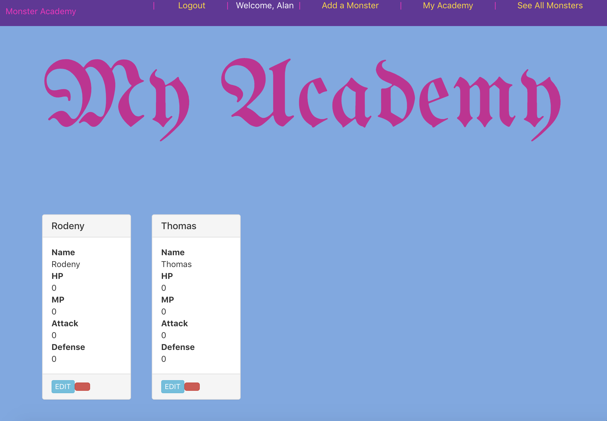

# Monster Academy

#### Description

#### Monster Academy is a web app designed to allow you to create all of your favorite Monsters.  You can add them to your academy or share them with all of your friends.

### Screenshots

### Technologies used
*  Javascript 
*  CSS
*  MongoDB
*  React
*  Node 
*  Express

### Getting Started

##### A Trello board used to track progress of the apps developement [here](https://trello.com/b/ToJAQuaT/monster-academy).

##### Visit and create a Monster with [Monster Academy](https://monsteracademy.herokuapp.com/).

### Credits
* Chajr - David Stinson: https://github.com/DavidStinson/chajr

### Icebox Goals

* Personalize each monster in your academy
* Add the ability to level up your monsters
* Add an arena to fight other monsters